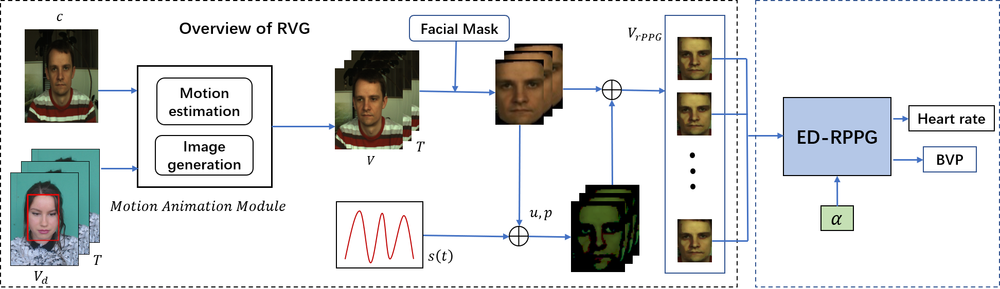
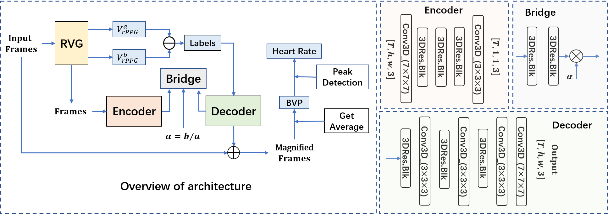

# Remote heart rate estimation based on rPPG amplification

#abstract

In this article, we propose an encoder-decoder model (ED-RPPG) to amplify the faint skin color changes of the face, so as to improve the signal-to-noise ratio of the target signal, thereby achieving a higher-precision estimation of the BVP signal and heart rate. In addition, we designed a rPPG video generation algorithm (RVG), which can synthesize facial videos containing rPPG information and the corresponding spatiotemporal BVP labels. The proposed method has achieved superior performance on the public-domain PURE and UBFC-RPPG databases.

#method

Overview of our RVG algorithm. Through a given basic image $c$ and a driving video $V_d$, a video $V$ with the same state as the driving video is synthesized. The face in video $V$ comes from the basic picture and does not contain rPPG information. Then the synthetic rPPG information is added to the video to get the synthetic facial video $V_{rPPG}$.

Overview of the proposed ED-RPPG model. The ED-RPPG mainly consists of three parts, encoder, bridge and decoder. In the training stage, RVG algorithm provides training data for the encoder and corresponding labels for the decoder. Labels are obtained by subtracting frames ($V_{rPPG}^a$, $V_{rPPG}^b$) with different signal intensity. The amplification factor $\alpha$ is the ratio of the signal intensity.

File 

The encoder-decoer.py file is a model file. You need to train the model with file train.py to obtain the network weights before using it.
After the pre-training is completed, use the test.py file to test the real data.
